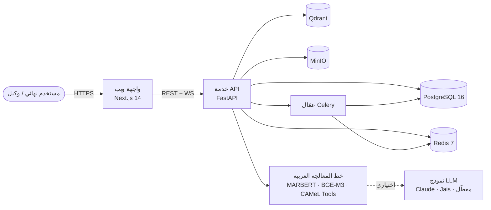

<div dir="rtl" lang="ar">

# بوت مكتب مساعدة تقنية المعلومات بالعربية

> نظام تذاكر مفتوح المصدر يُستضاف ذاتيًا لمكتب مساعدة تقنية المعلومات، بدعم عربي من الدرجة الأولى.
> واجهة ثنائية اللغة (عربي/إنجليزي، اتجاهان RTL/LTR)، تصنيف ذكي للنصوص العربية، نشر متوافق مع نظام حماية البيانات الشخصية السعودي (PDPL).

<p align="left">
  <a href="LICENSE"></a>
  <a href="docs/decisions/"></a>
  <a href="README.md"></a>
</p>

**اللغات:** [العربية](README.ar.md) · [English](README.md)

---

## لماذا هذا المشروع؟

أنظمة مكاتب المساعدة الجاهزة (Zendesk، Freshdesk، Jira Service Management) تتعامل مع العربية كواجهة مترجمة فوق نواة معالجة لغة إنجليزية. والبدائل مفتوحة المصدر (Zammad، FreeScout، osTicket، Chatwoot) لا تقدّم معالجة لغوية عربية مخصصة. هذا المشروع يسدّ الفجوة بمحوّلات عربية حديثة، ودعم للهجات، ومعالجة الـ"عربيزي"، وتجربة نشر متوافقة مع نظام PDPL لخدمة السوق الخليجي.

## أهم المزايا

* **واجهة ثنائية اللغة** بالعربية والإنجليزية مع عرض RTL/LTR صحيح في كل صفحة.
* **معالجة لغوية عربية** مبنية على MARBERT وCAMeLBERT وBGE-M3 وأدوات CAMeL — تغطي الفصحى الحديثة والخليجية والمصرية والشامية، إضافة إلى العربيزي وتبادل الشيفرات بين العربية والإنجليزية.
* **لوحة مساعد للوكلاء بالذكاء الاصطناعي:** ملخص في ثلاث جمل، أعلى خمس مقالات من قاعدة المعرفة، مسودة رد، مؤشرات للمشاعر والإلحاح، زر تبديل عربي/إنجليزي.
* **حقيبة امتثال PDPL:** نقاط نهاية لحقوق صاحب البيانات، سجل موافقات، سجل نقل عبر الحدود، نموذج تبليغ عن خرق.
* **يُستضاف ذاتيًا أولًا:** يعمل على خادم VPS واحد عبر `docker compose`، ويتوسّع إلى Kubernetes عبر مخطط Helm المُرفق.
* **رخصة Apache 2.0** — الانتاج التجاري والتفرّع مرحّب بهما.

## المعمارية



راجع [docs/architecture/overview.md](docs/architecture/overview.md) للتفاصيل الكاملة.

## البدء السريع

```bash
git clone https://github.com/USER/arabic-helpdesk-bot
cd arabic-helpdesk-bot
cp .env.example .env
make setup        # تثبيت اعتماديات بايثون (uv) ونود (pnpm) وتوليد مفاتيح JWT
make dev          # تشغيل postgres / redis / qdrant / minio + api + web
```

ثم زر:

* الواجهة — http://localhost:3000
* وثائق الـ API — http://localhost:8000/docs

لتشغيل عرض توضيحي معبّأ ببيانات (تذاكر ومقالات بالعربية والإنجليزية):

```bash
make demo
```

## التوثيق

* [دليل البداية](docs/getting-started/)
* [نظرة عامة على المعمارية](docs/architecture/)
* [الغوص في المعالجة اللغوية العربية](docs/guides/arabic-nlp.md)
* [دليل الاستضافة الذاتية](docs/guides/self-hosting.md)
* [سجل القرارات المعمارية (ADRs)](docs/decisions/)
* [وثيقة متطلبات المنتج (PRD)](docs/PRD.md)
* [ملاحظات البحث](docs/research/)

## الحالة

المشروع في **مرحلة بناء مبكرة نشطة**. اكتملت المرحلة 0 (بحث + ADRs + PRD) والمرحلة 1 (أساس المستودع). أما المراحل 2 إلى 11 فمتابعة في GitHub Issues وفي وثيقة [PRD](docs/PRD.md).

## المساهمة

طلبات السحب مرحب بها. يرجى قراءة [CONTRIBUTING.md](CONTRIBUTING.md) لمعرفة إعداد التطوير وأعراف الالتزام (commits) وعملية المراجعة. بالمشاركة فأنت توافق على [مدوّنة السلوك](CODE_OF_CONDUCT.md).

## الأمن

راجع [SECURITY.md](SECURITY.md) لسياسة الإفصاح المسؤول عن الثغرات.

## الرخصة

رخصة Apache 2.0. راجع [LICENSE](LICENSE) و[NOTICE](NOTICE).

## شكر وتقدير

مختبر CAMeL (جامعة نيويورك أبوظبي)، فريق Farasa (معهد قطر لبحوث الحوسبة)، فريق UBC NLP (MARBERT)، مختبر AUB MIND Lab (AraBERT)، BAAI (BGE-M3 وBGE Reranker)، Inception/G42/Cerebras (Jais)، ومجتمع أبحاث المعالجة اللغوية العربية الأشمل الذي يجعل هذا المنتج ممكنًا.

</div>
