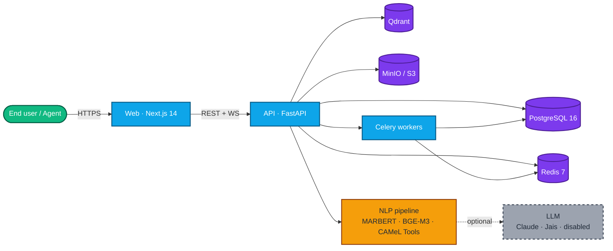

<div align="center" dir="rtl" lang="ar">

# بوت مكتب مساعدة تقنية المعلومات بالعربية

**نظام تذاكر مفتوح المصدر يُستضاف ذاتيًا، مصمَّم للفِرق التي تعمل بالعربية.**
واجهة ثنائية اللغة (RTL/LTR)، معالجة لغوية مدركة للهجات، استضافة جاهزة لـ PDPL.

[](LICENSE)
[](#خارطة-الطريق)
[](#الحزمة-التقنية)
[](docs/guides/arabic-nlp.md)
[](docs/compliance/pdpl-checklist.md)
[](README.md)

[البدء السريع](#البدء-السريع) · [المزايا](#المزايا) · [المعمارية](#المعمارية) · [التوثيق](#التوثيق) · [خارطة الطريق](#خارطة-الطريق)

</div>

---

<div dir="rtl" lang="ar">

## لماذا هذا المشروع؟

أغلب أنظمة مكاتب المساعدة الجاهزة — Zendesk وFreshdesk وJira Service Management — تتعامل مع العربية كواجهة مترجمة فوق نواة معالجة لغة إنجليزية. والبدائل مفتوحة المصدر (Zammad، FreeScout، osTicket، Chatwoot) لا تقدّم معالجة لغوية عربية مخصّصة على الإطلاق. الفِرق في جدة والرياض ودبي والدوحة ينتهي بها الحال إلى ترجمة التذاكر في رؤوسها.

يسدّ هذا المشروع الفجوة بمحوّلات عربية حديثة، وتغطية كاملة للهجات، ومعالجة العربيزي، وتجربة نشر تحترم نظام حماية البيانات الشخصية السعودي افتراضيًا.

## المزايا

| | |
|---|---|
| **تجربة ثنائية اللغة** | كل صفحة قابلة للاستخدام بالعربية (RTL) والإنجليزية (LTR) بنفس الإتقان. توجيه حسب اللغة، تواريخ هجرية أو ميلادية، خطوط عربية مستضافة ذاتيًا. |
| **خط معالجة لغوية عربية** | تطبيع، كشف اللغة واللهجة (فصحى، خليجية، مصرية، شامية)، معالجة عربيزي، تصنيف الفئة والإلحاح، استرجاع هجين من قاعدة المعرفة مع إعادة ترتيب. |
| **مساعد ذكي للوكلاء** | ملخص تلقائي في ثلاث جمل، أعلى خمس مقالات مع درجة الصلة، مسودة رد مع استشهادات، مؤشرات للمشاعر والإلحاح، زر ترجمة بنقرة واحدة. |
| **متوافق مع PDPL افتراضيًا** | سجل موافقات، نقاط نهاية لحقوق صاحب البيانات، سجل نقل عبر الحدود، نموذج إشعار خرق. اتصالات LLM معطّلة حتى يفعّلها المسؤول صراحةً. |
| **LLM قابل للتبديل** | Anthropic Claude، أو Jais محلي عبر Ollama، أو معطّل تمامًا — اختر لكل مستأجر. كل ميزة تعمل بشكل متدرّج بدون LLM. |
| **استضافة ذاتية أولًا** | خادم VPS واحد عبر Docker Compose، توسّع إلى Kubernetes عبر مخطط Helm المرفق، وحدة Terraform لمنطقة AWS `me-south-1`. |
| **قابل للمراقبة** | مقاييس Prometheus، سجلات JSON منظَّمة مع إخفاء البيانات الشخصية، تتبّع OpenTelemetry، لوحات Grafana جاهزة للاستيراد. |
| **رخصة Apache 2.0** | رخصة متساهلة. التفرّع التجاري مرحَّب به. |

## الحزمة التقنية

- **الواجهة الأمامية** — Next.js 14 App Router، TypeScript صارم، Tailwind، next-intl، مكوّنات Radix
- **الواجهة الخلفية** — FastAPI، Pydantic v2، SQLAlchemy 2.0 غير متزامن، Alembic، Argon2id، RS256 JWT، RBAC
- **البيانات** — PostgreSQL 16 (مع إعداد FTS عربي مخصّص)، Redis 7، Qdrant، MinIO / S3
- **المعالجة اللغوية** — MARBERT، CAMeLBERT، BGE-M3، BGE-Reranker-v2-m3، أدوات CAMeL
- **LLM** — Anthropic Claude (مع تفعيل ذاكرة المُوجَّه) أو Jais-30B محلي عبر Ollama
- **العمّال** — Celery + Redis
- **البنية التحتية** — Docker، Helm، Terraform (AWS)، nginx + Let's Encrypt
- **المراقبة** — Prometheus، Grafana، Loki، Tempo، structlog

</div>

## المعمارية



<div dir="rtl" lang="ar">

خريطة الوحدات الكاملة ودورة حياة الطلب: [`docs/architecture/overview.md`](docs/architecture/overview.md). مخطّط قاعدة البيانات ومخطّط ER: [`docs/architecture/db.md`](docs/architecture/db.md).

## البدء السريع

**المتطلبات المسبقة:** Docker + Compose v2، Node 20+، pnpm 9+، Python 3.12+، [uv](https://docs.astral.sh/uv/)، Make.

```bash
git clone https://github.com/to7vx/Arabic-IT-Helpdesk-Bot
cd Arabic-IT-Helpdesk-Bot
cp .env.example .env
make setup        # تثبيت الاعتماديات، توليد مفاتيح JWT، إعداد pre-commit
make demo         # تشغيل البيئة الكاملة وتعبئة بيانات تجريبية ثنائية اللغة
```

ثم افتح:

| السطح | الرابط | بيانات الدخول الافتراضية |
|---|---|---|
| الواجهة (العربية، الافتراضية) | http://localhost:3000 | `admin@example.com` / `DemoPassword!123` |
| الواجهة (الإنجليزية) | http://localhost:3000/en | نفس البيانات |
| وثائق API | http://localhost:8000/docs | — |
| لوحة MinIO | http://localhost:9001 | `minioadmin` / `minioadmin` |

للنشر الإنتاجي، راجع [`docs/getting-started/deployment.md`](docs/getting-started/deployment.md).

## التوثيق

- **[البدء السريع](docs/getting-started/quickstart.md)**
- **[التثبيت](docs/getting-started/installation.md)**
- **[النشر](docs/getting-started/deployment.md)**
- **[نظرة عامة على المعمارية](docs/architecture/overview.md)**
- **[الغوص في المعالجة اللغوية العربية](docs/guides/arabic-nlp.md)**
- **[دليل الاستضافة الذاتية](docs/guides/self-hosting.md)**
- **[سجلات القرارات المعمارية (ADRs)](docs/decisions/)**
- **[وثيقة متطلبات المنتج (PRD)](docs/PRD.md)**
- **[قائمة امتثال PDPL](docs/compliance/pdpl-checklist.md)**
- **[نموذج التهديدات](docs/security/threat-model.md)**

## خارطة الطريق

**v0.1 (الآن)** — أساس المستودع، مخطّط قاعدة بيانات كامل مع الترحيلات، خلفية FastAPI بثماني مجموعات راوترات، WebSocket، خط معالجة لغوية عربية بأساسات v0، واجهة Next.js ثنائية اللغة، تجهيزات تكاملات، Docker / Helm / Terraform، وثائق أمن وامتثال، موقع MkDocs، مقال إطلاق ثنائي اللغة.

**v0.2 — الربع الثالث 2026**
- مصنّف فئات MARBERT مضبوط دقيقًا مع تصدير ONNX مكمّى
- نمو مجموعة التقييم الذهبية إلى ≥ 500 تذكرة مُعنونة
- مجموعة اختبارات تكامل عبر testcontainers
- نشر عرض توضيحي مباشر

**v0.3 — الربع الرابع 2026**
- اختبار تكاملات Slack وMicrosoft Teams ميدانيًا
- مكتبة API مكتوبة الأنواع مولَّدة من OpenAPI
- منتقي تواريخ هجري في نماذج SLA الإدارية
- رأس مصنّف للهجة السعودية

**v1.0 — الربع الأول 2027**
- مخطّط Helm بمستوى إنتاجي مع HA افتراضية
- تكامل WhatsApp Business
- مكتبة ردود جاهزة بقوالب ثنائية اللغة
- لوحة معايير عامة

## المساهمة

طلبات السحب مرحَّب بها. ابدأ بـ [`CONTRIBUTING.md`](CONTRIBUTING.md) لإعداد التطوير وأعراف الفروع والالتزامات وبوابة تقييم المعالجة اللغوية. بالمشاركة فأنت توافق على [مدوّنة السلوك](CODE_OF_CONDUCT.md).

## الأمن

إذا اكتشفت ثغرة، اتّبع مسار الإفصاح المسؤول في [`SECURITY.md`](SECURITY.md) بدلاً من فتح Issue عامة.

## الرخصة

صادر تحت [Apache License 2.0](LICENSE). الإسنادات للاعتماديات في [`NOTICE`](NOTICE).

## شكر وتقدير

مبنيّ على عمل مختبر CAMeL (جامعة نيويورك أبوظبي)، فريق Farasa (معهد قطر لبحوث الحوسبة)، فريق UBC NLP (MARBERT)، مختبر AUB MIND Lab (AraBERT)، BAAI (BGE-M3، BGE Reranker)، Inception/G42/Cerebras (Jais)، ومجتمع أبحاث المعالجة اللغوية العربية الأشمل الذي يجعل هذا المنتج ممكنًا.

</div>
