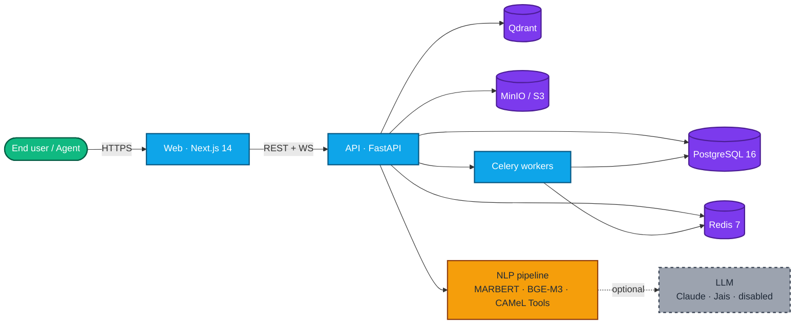

<div align="center">

# Arabic IT Helpdesk Bot

**Open-source, self-hosted IT helpdesk built for Arabic-speaking teams.**
Bilingual UX (Arabic RTL + English LTR), dialect-aware NLP, PDPL-ready deployment.

[](LICENSE)
[](#roadmap)
[](#tech-stack)
[](docs/guides/arabic-nlp.md)
[](docs/compliance/pdpl-checklist.md)
[](README.ar.md)

[Quickstart](#quickstart) · [Features](#features) · [Architecture](#architecture) · [Docs](#documentation) · [Roadmap](#roadmap)

</div>

---

## Why this exists

Most off-the-shelf helpdesks — Zendesk, Freshdesk, Jira Service Management — treat Arabic as a translated UI bolted onto an English NLP core. The open-source alternatives (Zammad, FreeScout, osTicket, Chatwoot) ship no Arabic-specific NLP at all. Teams in Jeddah, Riyadh, Dubai, and Doha end up translating tickets in their heads.

This project fills the gap with research-grade Arabic encoders, full dialect coverage, Arabizi handling, and a deployment story that respects Saudi PDPL out of the box.

## Features

| | |
|---|---|
| **Bilingual UX** | Every page works in Arabic (RTL) and English (LTR) with the same polish. Locale-aware routing, dates in Hijri or Gregorian, Arabic fonts self-hosted. |
| **Arabic NLP pipeline** | Normalization, language and dialect detection (MSA, Gulf, Egyptian, Levantine), Arabizi handling, category and urgency classification, hybrid KB retrieval with reranking. |
| **Agent AI copilot** | Auto-summary in three sentences, top-5 KB suggestions with relevance, draft reply with citations, sentiment and urgency signals, one-click translate. |
| **PDPL-aware by default** | Consent ledger, Data Subject Rights endpoints, cross-border transfer log, breach notification template. LLM calls disabled until an admin explicitly opts in. |
| **Pluggable LLM** | Anthropic Claude, local Jais via Ollama, or fully disabled — pick per tenant. Every feature degrades gracefully without an LLM. |
| **Self-hosted first** | One VPS via Docker Compose, scales to Kubernetes via the bundled Helm chart, Terraform module for AWS in `me-south-1`. |
| **Observable** | Prometheus metrics, structured JSON logs with PII redaction, OpenTelemetry tracing, ready-to-import Grafana dashboards. |
| **Apache 2.0** | Permissive license. Commercial forks welcome. |

## Tech stack

- **Frontend** — Next.js 14 App Router, TypeScript strict, Tailwind, next-intl, Radix primitives
- **Backend** — FastAPI, Pydantic v2, SQLAlchemy 2.0 async, Alembic, Argon2id, RS256 JWT, RBAC
- **Data** — PostgreSQL 16 (with custom Arabic FTS config), Redis 7, Qdrant, MinIO / S3
- **NLP** — MARBERT, CAMeLBERT, BGE-M3, BGE-Reranker-v2-m3, CAMeL Tools
- **LLM** — Anthropic Claude (prompt cache enabled) or local Jais-30B via Ollama, swappable
- **Workers** — Celery + Redis
- **Infra** — Docker, Helm, Terraform (AWS), nginx + Let's Encrypt
- **Observability** — Prometheus, Grafana, Loki, Tempo, structlog

## Architecture



Full module map and request lifecycle: [`docs/architecture/overview.md`](docs/architecture/overview.md). Database schema and ER diagram: [`docs/architecture/db.md`](docs/architecture/db.md).

## Quickstart

**Prerequisites:** Docker + Compose v2, Node 20+, pnpm 9+, Python 3.12+, [uv](https://docs.astral.sh/uv/), Make.

```bash
git clone https://github.com/to7vx/Arabic-IT-Helpdesk-Bot
cd Arabic-IT-Helpdesk-Bot
cp .env.example .env
make setup        # installs deps, generates JWT keys, sets up pre-commit
make demo         # boots the full stack and seeds bilingual sample data
```

Then open:

| Surface | URL | Default credentials |
|---|---|---|
| Web (Arabic, default) | http://localhost:3000 | `admin@example.com` / `DemoPassword!123` |
| Web (English) | http://localhost:3000/en | same |
| API docs | http://localhost:8000/docs | — |
| MinIO console | http://localhost:9001 | `minioadmin` / `minioadmin` |

For production deployment, see [`docs/getting-started/deployment.md`](docs/getting-started/deployment.md).

## Documentation

- **[Quickstart](docs/getting-started/quickstart.md)** — three-command demo install
- **[Installation](docs/getting-started/installation.md)** — prerequisites and full setup
- **[Deployment](docs/getting-started/deployment.md)** — Docker Compose, Helm, Terraform
- **[Architecture overview](docs/architecture/overview.md)** — modules, request lifecycle
- **[Arabic NLP deep-dive](docs/guides/arabic-nlp.md)** — preprocessing, dialects, retrieval, evaluation
- **[Self-hosting guide](docs/guides/self-hosting.md)** — single host to multi-host
- **[ADRs](docs/decisions/)** — every architecture decision with rationale
- **[PRD](docs/PRD.md)** — personas, requirements, success metrics
- **[PDPL checklist](docs/compliance/pdpl-checklist.md)** — operator sign-off
- **[Threat model](docs/security/threat-model.md)** — STRIDE analysis

## Roadmap

**v0.1 (today)** — Repository foundation, full schema and migrations, FastAPI backend with 8 router groups, WebSocket fanout, Arabic NLP pipeline with v0 baselines, Next.js bilingual frontend, integration scaffolding, Docker / Helm / Terraform, security and compliance docs, MkDocs site, bilingual launch post.

**v0.2 — Q3 2026**
- Fine-tuned MARBERT category classifier with ONNX-quantized export
- Golden evaluation set grown to ≥ 500 labeled tickets
- Integration test suite via testcontainers
- Live demo deployment

**v0.3 — Q4 2026**
- Slack and Microsoft Teams integrations field-tested end-to-end
- Typed API client generated from OpenAPI consumed by the web app
- Hijri date picker in admin SLA forms
- Saudi dialect classifier head

**v1.0 — Q1 2027**
- Production-grade Helm chart with HA defaults
- WhatsApp Business integration
- Macro / canned-response library with bilingual templates
- Public benchmark dashboard

Full backlog and PRD: [`docs/PRD.md`](docs/PRD.md). File issues to influence priority.

## Contributing

Pull requests welcome. Start with [`CONTRIBUTING.md`](CONTRIBUTING.md) for the dev setup, branch and commit conventions, and the NLP eval gate. By participating you agree to the [Code of Conduct](CODE_OF_CONDUCT.md).

Particularly useful contributions:
- Labeled Arabic ticket data (any dialect) for the golden evaluation set
- Arabic font tuning and RTL UX polish
- KB articles in any IT domain (bilingual or one side and we will translate)
- Integration tests against real Postgres / Redis / Qdrant via testcontainers

## Security

If you find a vulnerability, please follow the responsible-disclosure path in [`SECURITY.md`](SECURITY.md) instead of opening a public issue.

## License

Released under the [Apache License 2.0](LICENSE). Attributions for upstream dependencies are listed in [`NOTICE`](NOTICE).

## Acknowledgments

Built on the work of CAMeL Lab (NYU Abu Dhabi), the Farasa team (Qatar Computing Research Institute), UBC NLP (MARBERT), AUB MIND Lab (AraBERT), BAAI (BGE-M3, BGE Reranker), Inception / G42 / Cerebras (Jais), and the broader Arabic NLP research community whose open work makes this product possible.
