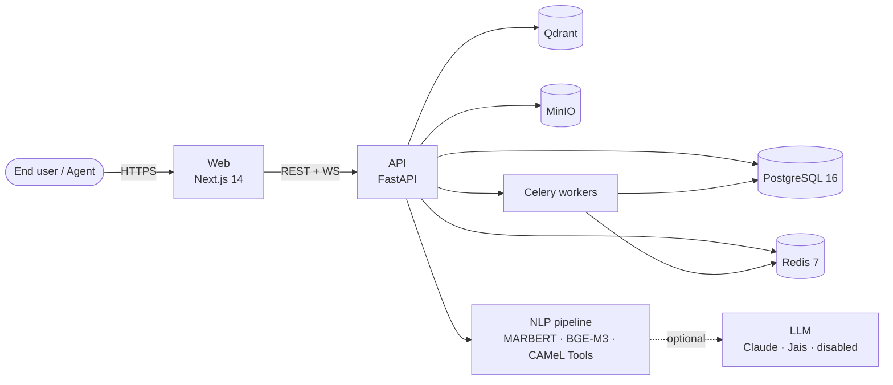

# Arabic IT Helpdesk Bot

> Open-source, self-hosted IT helpdesk with first-class Arabic-language support.
> Bilingual UI (ar/en, RTL/LTR), Arabic NLP triage, PDPL-aware deployment.

<p align="left">
  <a href="LICENSE"></a>
  <a href="https://github.com/USER/arabic-helpdesk-bot/actions"></a>
  <a href="docs/decisions/"></a>
  <a href="docs/PRD.md"></a>
  <a href="README.ar.md"></a>
</p>

**Languages:** [English](README.md) · [العربية](README.ar.md)

---

## Why

Most off-the-shelf helpdesks (Zendesk, Freshdesk, Jira Service Management) treat Arabic as a translated UI bolted onto an English NLP core. Open-source alternatives (Zammad, FreeScout, osTicket, Chatwoot) ship no Arabic-specific NLP at all. This project fills the gap with research-grade Arabic encoders, dialect support, Arabizi handling, and a PDPL-aware deployment story for the GCC market.

## Highlights

* **Bilingual UI** in Arabic and English with proper RTL/LTR rendering on every page.
* **Arabic NLP** built on MARBERT, CAMeLBERT, BGE-M3, and CAMeL Tools — covers MSA, Gulf, Egyptian, Levantine dialects, Arabizi, and Arabic↔English code-switching.
* **AI Copilot panel** for agents: 3-sentence summary, top-5 KB suggestions, draft reply, sentiment & urgency, ar↔en toggle.
* **PDPL toolkit:** DSR endpoints, consent ledger, cross-border transfer log, breach-notification template.
* **Self-hosted-first:** runs on a single VPS via `docker compose`, scales to Kubernetes via the included Helm chart.
* **Apache 2.0** — commercial-friendly forks welcome.

## Architecture



See [docs/architecture/overview.md](docs/architecture/overview.md) for the full picture.

## Quickstart

```bash
git clone https://github.com/USER/arabic-helpdesk-bot
cd arabic-helpdesk-bot
cp .env.example .env
make setup        # installs python (uv) + node (pnpm) deps, generates JWT keys
make dev          # starts postgres / redis / qdrant / minio + api + web
```

Then visit:

* Web — http://localhost:3000
* API docs — http://localhost:8000/docs

For a populated demo (Arabic + English sample tickets and KB articles):

```bash
make demo
```

## Documentation

* [Getting started](docs/getting-started/)
* [Architecture overview](docs/architecture/)
* [Arabic NLP deep-dive](docs/guides/arabic-nlp.md)
* [Self-hosting guide](docs/guides/self-hosting.md)
* [Architecture Decision Records](docs/decisions/)
* [Product Requirements Document](docs/PRD.md)
* [Research notes](docs/research/)

## Status

This repository is in **active early-phase build**. Phase 0 (research + ADRs + PRD) and Phase 1 (repository foundation) are complete. Phases 2–11 are tracked in GitHub Issues and the [PRD](docs/PRD.md).

## Contributing

Pull requests welcome. Please read [CONTRIBUTING.md](CONTRIBUTING.md) for the dev setup, commit conventions, and review process. By participating you agree to the [Code of Conduct](CODE_OF_CONDUCT.md).

## Security

See [SECURITY.md](SECURITY.md) for the responsible-disclosure policy.

## License

Apache License 2.0. See [LICENSE](LICENSE) and [NOTICE](NOTICE).

## Acknowledgments

CAMeL Lab (NYU Abu Dhabi), the Farasa team (Qatar Computing Research Institute), UBC NLP (MARBERT), AUB MIND Lab (AraBERT), BAAI (BGE-M3, BGE Reranker), Inception / G42 / Cerebras (Jais), and the broader Arabic NLP research community whose open work makes this product possible.
