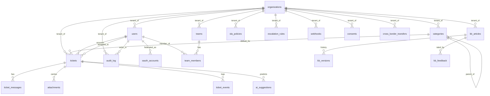

# Database Schema

PostgreSQL 16. Schema defined in `apps/api/src/helpdesk/db/models/`, materialized by Alembic. All models inherit the timestamp mixin and most use a soft-delete mixin.

## Extensions enabled

* `pg_trgm` — trigram indexes for fuzzy Arabic/English title search.
* `unaccent` — required by the custom `arabic_simple` text-search config.
* `btree_gin` — GIN indexes that can combine btree and tsvector columns.
* `pgcrypto` — `gen_random_uuid()` server-side defaults.
* `uuid-ossp` — kept for legacy compatibility.

## Arabic full-text search

We ship a custom config `arabic_simple` (see [ADR-0009](../decisions/0009-postgres-arabic-fts.md)). The `tickets` table holds two materialized `tsvector` columns (`fts_en`, `fts_ar`) kept up to date by an `AFTER INSERT OR UPDATE` trigger. Application layer fuses BM25 ranks from both with dense vector scores via RRF.

## ER diagram

## Column highlights

### `tickets`

| Column | Notes |
|---|---|
| `public_id` | Human-readable, e.g. `TKT-2026-00042`. Unique. |
| `title`, `description` | Original text, preserved verbatim. |
| `normalized_text` | After Arabic normalization (alef forms, diacritics, etc.). Used for retrieval, not for display. |
| `language_detected`, `dialect_detected` | Populated by the NLP pipeline; helps route to the right team. |
| `fts_en`, `fts_ar` | `tsvector`s maintained by `tickets_tsvector_update()` trigger. |
| `sentiment_score`, `urgency_score` | NLP predictions; nullable when LLM/encoders aren't run. |
| `merged_into_id` | Self-reference for ticket merge. |

### `ai_suggestions`

Every prediction is recorded with its `model_version` and `preprocessing_version`. When an agent accepts a suggestion unchanged we mark `accepted=True`; when they edit, `accepted=False`. This becomes the training signal for the next model release without us having to re-label.

### `cross_border_transfers`

Mandatory log entry whenever personal data leaves the Kingdom (see [ADR-0014](../decisions/0014-data-residency-and-pdpl-compliance.md)). The admin UI shows a heat-map of transfers per destination.

### `audit_log`

Append-only. `prev_hash` and `entry_hash` form a hash-chain computed in the application layer at insert time, so any tampering becomes detectable on next read.

## Indexes

Every foreign key column has an explicit index. Common filter columns have additional indexes: `tickets(org_id, status)`, `tickets(assignee_id)`, `tickets(created_at)`, `tickets(sla_due_at)`. The `tickets.title` column has a `gin_trgm_ops` trigram index for fuzzy search.

## Soft deletes

`organizations`, `users`, `teams`, `categories`, `tickets`, `kb_articles`, `webhooks` use `deleted_at IS NULL` filtering at the repository layer. A nightly job hard-deletes rows whose retention window expired.

## Multi-tenancy

When `MULTI_TENANT=true`, every `org_id`-scoped table has a Row-Level Security policy that filters on `current_setting('app.org_id')`. The API sets this value once per connection checkout from the pool.
