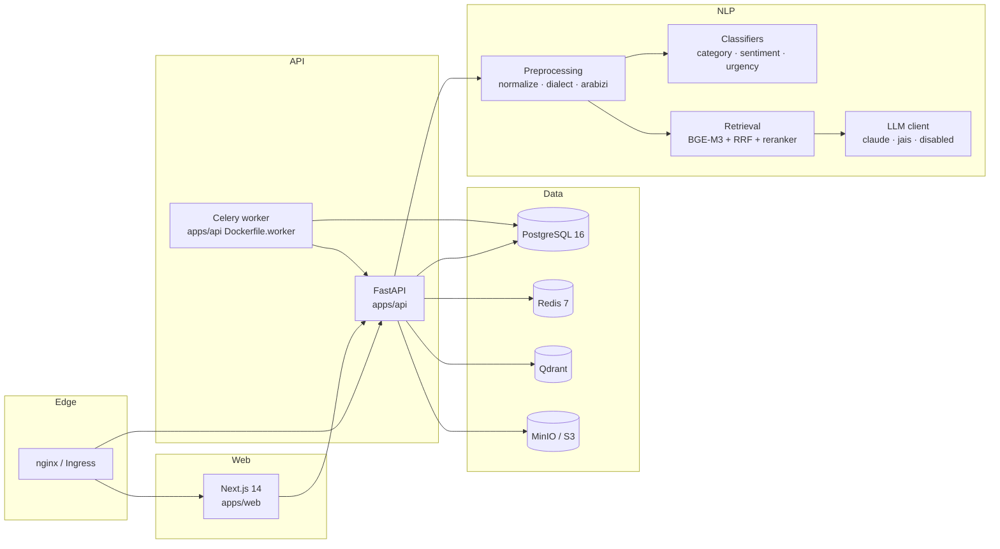

# Architecture Overview

## Request lifecycle (create ticket)

1. `apps/web` POSTs to `/api/v1/tickets`.
2. `tickets.create_ticket` router authenticates the caller, calls `ticket_service.create_ticket` which mints `public_id`, logs `created` event, and returns the serialized ticket.
3. Async work — NLP classify, embedding index update, webhook fan-out — is enqueued on Celery so the user does not wait.
4. A Redis pub/sub message fans the event to every connected `/ws/tickets` subscriber for that org.

## Modules

* `helpdesk.api.v1` — REST.
* `helpdesk.api.ws` — WebSocket.
* `helpdesk.services` — domain services (the only place that mutates state).
* `helpdesk.repositories` — read-only queries (Phase 3b).
* `helpdesk.nlp` — preprocessing, classification, retrieval, generation, evals.
* `helpdesk.integrations` — email, slack, teams, whatsapp, webhooks, csv.
* `helpdesk.workers` — Celery tasks.
* `helpdesk.middleware` — request-id, logging, security headers, rate limit, error handler.
* `helpdesk.observability` — structlog + OTLP.

## Cross-cutting concerns

* **Auth:** RS256 JWT short-lived access + rotating refresh in httpOnly cookie. RBAC via explicit permission strings (`helpdesk.services.rbac`).
* **Multi-tenancy:** Postgres RLS when `MULTI_TENANT=true`; otherwise every query still scopes by `org_id` because the seed always creates the `default` org.
* **PDPL:** `LLM_PROVIDER=disabled` default; every cross-border call appended to `cross_border_transfers`.

See [ADRs](../decisions/README.md) for rationale on every choice.
