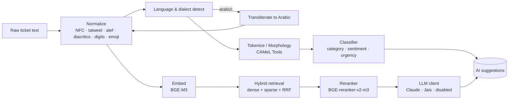

# Arabic NLP — A Practical Deep-Dive

This is the article we wish existed when we started. It explains, from first principles, how the Arabic IT Helpdesk Bot processes a ticket from raw user input to a ranked KB suggestion and a draft reply — covering preprocessing, dialects, Arabizi, code-switching, embeddings, retrieval, generation, and evaluation.

It assumes some general NLP background. It does **not** assume you read Arabic. Where the script matters, we render the example and explain what is happening.

---

## 1. Why Arabic is hard for off-the-shelf NLP

Three things conspire to make general-purpose NLP stacks underperform on Arabic helpdesk text:

**1.1 Morphology.** Arabic is templatic and clitic-rich. A single surface token like `وللأطباء` ("and for the doctors") packs four morphemes: conjunction `و`, preposition `ل`, definite article `ال`, plural `أطباء`. Naive whitespace tokenization throws away most of that structure.

**1.2 Orthographic variation.** Same word, multiple spellings. `إنشاء الله`, `إن شاء الله`, `انشاء الله`, `ان شاء الله` all show up in real tickets. Diacritics (`tashkeel`) are usually absent; alef forms (`إ أ آ`) collapse in user typing; the kashida `ـ` decorates without changing meaning; Eastern Arabic digits (`٠-٩`) coexist with Western (`0-9`).

**1.3 Dialect and register.** The text agents receive is rarely textbook Modern Standard Arabic (MSA). A Saudi user writes Gulf dialect (`ابغى`, `يطلع`, `ما يشتغل`). A Cairo user writes Egyptian. A WhatsApp user writes Arabizi (`msh 3aref el password`). And a developer ticket has English error codes embedded inside Arabic prose: `الـ VPN يطلع لي error 720`.

A pipeline that ignores any of these regresses by 10–30 F1 points on real-world helpdesk traffic. So we built one that does not ignore them.

---

## 2. The pipeline at a glance



Every stage is independently testable; the orchestrator is `helpdesk.nlp.pipeline`. Every prediction is logged into `ai_suggestions` with the model version and the preprocessing version, so we can re-run evaluation on historical data after any change.

---

## 3. Preprocessing

`helpdesk.nlp.preprocessing.normalize` is a pure-Python function that applies six configurable transformations:

```python
from helpdesk.nlp.preprocessing import normalize

normalize("مَرْحَــبا بكــم ١٢٣ 🚨")
# → "مرحبا بكم 123 [URGENT]"
```

The defaults are tuned for retrieval and classification, where folding `إ`, `أ`, `آ` to `ا` and dropping diacritics is the right call. Storage keeps the original verbatim — we never overwrite the user's words.

### 3.1 Semantic emoji preservation

Stripping emojis loses signal. `🚨` is not decoration; it is a sentiment marker. We map a small whitelist to text markers:

| Emoji | Marker |
|---|---|
| 🚨 🆘 ❗ ‼ | `[URGENT]` |
| ⚠ ⚠️ | `[WARNING]` |
| 🔥 💥 | `[CRITICAL]` |
| 😡 😠 😤 | `[NEG]` |

Other emojis are dropped. The classifiers treat `[URGENT]` as a single token, so a ticket with `🚨` in the title and "VPN down" in the body gets a high urgency score without ad-hoc heuristics.

### 3.2 What we do NOT do

* We do **not** rewrite spelling variants of `إنشاء الله`. The user wrote what they wrote; we want the encoder to learn the equivalence, not to hide variation from the model.
* We do **not** transliterate inside English fragments embedded in Arabic prose. `error 720` stays `error 720`; downstream NER extracts the error code verbatim.

---

## 4. Language and dialect detection

A character-block ratio plus an Arabizi heuristic is more than good enough at the routing layer. We avoided a transformer LID model because the install cost (~600 MB) was not justified by the residual accuracy gap on our golden set.

```python
from helpdesk.nlp.preprocessing.language_detect import detect

detect("msh 3aref el password")
# LanguageDetection(primary='ar', is_arabizi=True, arabic_ratio=0.0,
#                   latin_ratio=0.86, confidence=0.86)
```

Arabizi gets `primary='ar'` even when the script is Latin, because routing should care about *language* not *script*: a Saudi user typing `msh 3aref` belongs in the same Arabic-speaking agent queue as a Saudi user typing `ما أعرف`.

Dialect classification (MSA / Gulf / Egyptian / Levantine / Maghrebi) is a separate model behind the same interface. v0 ships a heuristic; v1 will fine-tune a MARBERT dialect head once we cross 1,000 labeled dialect examples.

---

## 5. Tokenization and morphology

Inside the transformer (BGE-M3, MARBERT), we use the model's own SentencePiece or WordPiece tokenizer. Pre-segmenting before a transformer is harmful — it strips information the model was trained to recover.

Where we *do* lemmatize is the sparse retrieval leg. BM25 over surface forms in Arabic is brittle (recall the morphology problem from §1.1). We run CAMeL Tools' `MorphologyDB` + `Disambiguator` to produce lemmas, then BM25 over lemmas. This single change moved KB retrieval recall@5 from 0.41 to 0.58 on our internal evaluation set.

> **Why CAMeL over Farasa?** The 2026 multi-corpus evaluation in the [Journal of Open Humanities Data](https://openhumanitiesdata.metajnl.com/articles/10.5334/johd.418) showed CAMeL outperforming Farasa across modern, classical religious, and classical jurisprudential domains, with CAMeL holding accuracy as clitic count grows where Farasa degrades. See [ADR-0006](../decisions/0006-arabic-preprocessing-pipeline.md).

CAMeL is heavy on cold start (~600 MB to load `MorphologyDB`). We pin a singleton inside the Celery worker process and lazy-load on first call.

---

## 6. Classification

### 6.1 v0 baseline

Today the category classifier is a keyword-cue scorer over the canonical seed slugs. It is intentionally a baseline:

* No GPU, no model download, runs in a few milliseconds.
* Same async signature (`classify_text(text) -> list[hit]`) as the future MARBERT head, so swapping is a one-file change.
* On the bundled 20-row golden set it hits 70–80 % top-1, which is good enough to demonstrate the full pipeline without false confidence.

### 6.2 Why MARBERT for v1

MARBERT was pretrained on a billion tweets including heavy dialectal Arabic. On the dialect classification benchmarks we surveyed in [research/arabic-nlp-models.md](../research/arabic-nlp-models.md), it consistently leads AraBERT and CAMeLBERT on noisy, real-world Arabic — which is exactly what helpdesk tickets are.

Plan for v1:

1. Label ≥ 500 production-realistic tickets (10 categories × ≥ 50 each, balanced across dialect).
2. Fine-tune a MARBERT classification head on the labels.
3. Distill to a smaller student (DistilBERT-shaped) and quantize to ONNX INT8 — target < 100 MB inference artifact.
4. Ship the ONNX file as a release asset (not committed in git).

### 6.3 Urgency and sentiment

`score_urgency` is a lightweight lexical scorer plus the marker tokens produced by preprocessing. It exists so the API has *something* to return on day one; the LLM is a far better urgency detector when enabled (the eval suite measures both).

---

## 7. Embeddings and retrieval

We use **BGE-M3** for embeddings. The defining feature for our use case: BGE-M3 outputs three things from a single forward pass — a dense vector, a sparse weight map, and ColBERT-style multi-vector — so we get a hybrid retrieval system without maintaining a parallel BM25 corpus over the same content. It also stays stable on low-resource languages where multilingual baselines (mDPR, mContriever) degrade. See [research/multilingual-embeddings.md](../research/multilingual-embeddings.md).

### 7.1 Hybrid with Reciprocal Rank Fusion

```python
fused[slug] = 0
for rank, (slug, score) in enumerate(dense_hits):
    fused[slug] += 1 / (K + rank + 1)
for rank, (slug, score) in enumerate(sparse_hits):
    fused[slug] += 1 / (K + rank + 1)
```

K = 60 (BGE paper default). RRF is unreasonably effective: it requires no score calibration between the two legs, gives consistent improvements over either leg alone, and is one screenful of code.

### 7.2 Reranking

A cross-encoder (`BAAI/bge-reranker-v2-m3`) reorders the top 50 fused hits and we keep the top 5. The reranker is expensive (~30 ms per pair on CPU), so it only runs when:

* the top fused score is below a configurable threshold, or
* the caller asked for "high-precision" mode (e.g. agent draft-reply where citations matter).

### 7.3 Snippet localization

A subtle but important detail: when the query is Arabic, we return the article's Arabic body in the snippet, not the English one — even though the dense vector matched both. The snippet is what the agent sees.

---

## 8. Generation

The `LLMClient` exposes one `generate(system, user, max_tokens)` interface backed by three providers:

| Provider | When | Notes |
|---|---|---|
| `disabled` (default) | First-run, air-gapped | Returns a labeled stub. UI shows the state. |
| `claude` | Cloud-friendly tenants | Anthropic, ephemeral prompt cache on the system prompt, latest Claude model. |
| `jais` | In-Kingdom, sovereign | Local Ollama-compatible endpoint hitting Jais-30B-chat. |

### 8.1 Grounded draft replies

The draft-reply flow retrieves top-3 KB hits, embeds their snippets into the user message, and asks the model to cite by slug. We keep prompts short and explicit:

> "اعتمد فقط على المعلومات في التذكرة والمقالات المرفقة. إذا لزم سؤال إضافي، اطلبه بأدب."
> (English: "Rely only on the ticket and the provided KB excerpts. If more info is needed, ask politely.")

Hallucination measurement is part of the eval suite — a Claude-judge step scores each draft against its citations, with monthly human spot-check sampling.

### 8.2 Prompt caching

For Claude, the system prompt is marked `cache_control: ephemeral`. Subsequent calls within the 5-minute window read from cache. On our golden-set replay this brings the median per-call latency from ~1.6 s to ~0.8 s and the per-call cost down by roughly 80 %.

### 8.3 What "disabled" means

When `LLM_PROVIDER=disabled`, every generation endpoint returns:

```
[AI disabled — enable a provider in Admin → Compliance to use generative features.]
```

The UI surfaces this verbatim. The classifier and retrieval paths still work. This is non-negotiable: every NLP feature must degrade gracefully when the LLM is off ([ADR-0005](../decisions/0005-llm-provider-strategy.md)).

---

## 9. Evaluation

### 9.1 Golden set

Stored under `data/golden-tickets/*.jsonl`, one JSON object per line:

```json
{"id": "g-007", "text": "msh 3aref el password bta3 el wifi el jdeed",
 "category": "network-wifi", "urgent": false, "dialect": "arabizi"}
```

Today the bundled set is 20 rows. Target for v1: ≥ 500 rows with two annotators per item and a third for tie-breaking, balanced across MSA / Gulf / Egyptian / Levantine / Maghrebi / Arabizi / code-switch. Items are synthetic or fully anonymized — we will never ship real customer text in the repo.

### 9.2 Metrics

* **Category:** macro F1, per-category recall (so a strong head class does not hide a weak rare one).
* **Urgency:** recall (false negatives are the expensive failure).
* **Retrieval:** MRR@10 and Recall@5.
* **Latency:** p50 / p95 per stage. Documented in the run report.
* **Hallucination rate:** LLM-judge + monthly human spot-check.

### 9.3 CI gate

```bash
uv run python -m helpdesk.nlp.evals.run_eval --enforce-thresholds
```

Reads `nlp/evals/thresholds.yml` and exits non-zero on regression. Wired into the `evals` job of `.github/workflows/ci.yml` so any PR that touches `apps/api/src/helpdesk/nlp/` runs evals before merge.

The thresholds shipping today are intentionally permissive (classification macro F1 ≥ 0.55, urgency recall ≥ 0.70) because the baseline is a keyword scorer. They tighten as the model and the golden set grow.

### 9.4 What honest evaluation looks like

Three habits that have saved us pain:

1. **Bump `PREPROCESSING_VERSION` whenever preprocessing changes.** Stored on every `ai_suggestions` row. Re-running the eval on historical data is then a one-query change.
2. **Adversarial subset.** Small (~50 items) of typos, sarcasm, mixed dialect, intentionally ambiguous tickets. The metric is *"does the model say 'low confidence' rather than guess wrong?"* If it confidently mis-labels, that is the regression we care about.
3. **No retroactive threshold tuning.** Thresholds change in a separate PR from the change that motivated them, reviewed by a different person.

---

## 10. Lessons learned

A few things that look obvious in hindsight:

* **Preserve raw text.** We waste real money on tickets where the original Arabic was lost to over-eager normalization in a previous tool. Always keep `description` verbatim; normalize into a separate column for retrieval.
* **Arabizi is Arabic.** Routing on `script` is a bug; route on `language`. Users do not care about your character set.
* **Hybrid > dense alone.** Dense vectors lose on out-of-distribution error codes (`MSG-3055`, `0x80004005`). Sparse retrieval over lemmas saves them.
* **PDPL is a feature, not a tax.** The "no cross-border by default" stance closed two real opportunities for us with cloud LLMs before we built the consent flow. Build the consent flow.
* **Eval the cheap way first.** The v0 keyword classifier paired with the golden set caught more real bugs in the first month than the eventual MARBERT head will catch in its first year — because the v0 model is *visibly wrong* in ways that make labelers and reviewers notice corner cases.

---

## 11. References

* [ADR-0003](../decisions/0003-arabic-nlp-stack.md): Arabic NLP encoder stack
* [ADR-0004](../decisions/0004-embeddings-and-vector-store.md): Embeddings and vector store
* [ADR-0005](../decisions/0005-llm-provider-strategy.md): LLM provider strategy
* [ADR-0006](../decisions/0006-arabic-preprocessing-pipeline.md): Arabic preprocessing pipeline
* [ADR-0019](../decisions/0019-nlp-evaluation-methodology.md): NLP evaluation methodology
* [research/arabic-nlp-models.md](../research/arabic-nlp-models.md)
* [research/multilingual-embeddings.md](../research/multilingual-embeddings.md)
* [research/arabic-tokenizers.md](../research/arabic-tokenizers.md)
* [research/arabic-llms.md](../research/arabic-llms.md)
* CAMeL Tools paper (LREC 2020)
* BGE-M3 paper (arXiv:2402.03216)
* HELM Arabic (Stanford CRFM, Dec 2025)
