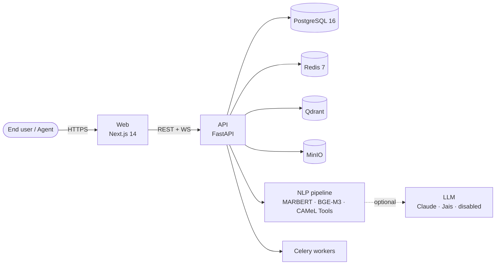

# Arabic IT Helpdesk Bot

Open-source, self-hosted IT helpdesk with first-class Arabic-language support, dialect-aware NLP, a bilingual UI (Arabic RTL + English LTR), and a PDPL-aware deployment story for the Saudi and GCC market.

## Where to go next

* **[Quickstart](getting-started/quickstart.md)** — `git clone` to running stack in under 10 minutes.
* **[Arabic NLP deep-dive](guides/arabic-nlp.md)** — how the pipeline handles MSA, Gulf, Egyptian, Levantine, Arabizi, and code-switching.
* **[ADRs](decisions/README.md)** — every architecture decision with rationale.
* **[PDPL checklist](compliance/pdpl-checklist.md)** — sign-off list for operators in the Kingdom.

## License

[Apache 2.0](https://github.com/USER/arabic-helpdesk-bot/blob/main/LICENSE). Commercial-friendly forks welcome.
