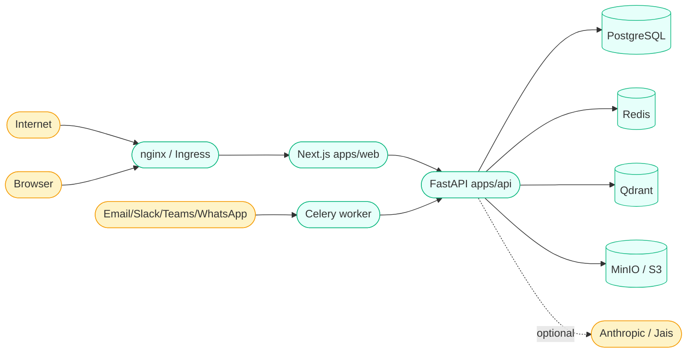

# Threat Model (STRIDE)

* **Status:** Living document. Updated at every major release.
* **Last review:** 2026-05-17

This document applies the [STRIDE](https://learn.microsoft.com/en-us/azure/security/develop/threat-modeling-tool-threats) framework to the system as described in `docs/architecture/overview.md`. Mitigations link to the code or config that implements them.

## Trust boundaries

Solid arrows cross a trust boundary; the LLM dotted arrow crosses both a trust boundary **and** a regulatory boundary (PDPL cross-border).

## STRIDE summary

| Category | Top risks | Primary mitigations |
|---|---|---|
| **S**poofing | Stolen session token; SAML/OIDC replay | Short-lived JWT + refresh rotation + Redis revocation; JTI per token; HTTPS; SAML message validation via Authlib |
| **T**ampering | Forged webhook ingest; SQL injection; tampered audit log | HMAC-SHA256 on every outbound webhook + signature verify on Slack/Teams; SQLAlchemy parameterized queries everywhere; hash-chained audit log (`prev_hash`/`entry_hash`) |
| **R**epudiation | Agent denying a status change | `ticket_events` + `audit_log` rows for every state transition with `actor_id`, `ip_address`, `user_agent`; append-only; hash chain |
| **I**nformation disclosure | PII in logs; ticket text in observability backend; over-broad access to other tenants | structlog `_redact_pii` processor strips fields tagged sensitive; ticket bodies are NEVER logged verbatim, only token counts and language tag; RBAC + per-object scopes; multi-tenant RLS (when enabled) |
| **D**enial of service | Single noisy client; oversized uploads; runaway LLM calls | Token-bucket rate limit middleware; nginx `client_max_body_size 25M`; Celery task time limits (600s hard / 540s soft); LLM provider has timeouts + retry caps |
| **E**levation of privilege | end_user gaining admin powers; role escalation via JWT tamper | Explicit RBAC permission map (no role string checks in business logic); JWT signed RS256 with keys mounted from disk; role-change events audited |

## Asset-by-asset risks

### Tickets and messages
* **Risk:** unauthorized read across tenants → leak of PII.
  * **Mitigation:** `ticket_service` requires `org_id` match before any read; multi-tenant deployments enable Postgres RLS; tests cover cross-org isolation.
* **Risk:** unredacted ticket text in monitoring.
  * **Mitigation:** structlog redaction list includes `description`, `body`, `ticket_text`. Reviewers must justify any new log fields that could carry user content.

### Authentication
* **Risk:** credential stuffing.
  * **Mitigation:** Argon2id hashing, 5-failure lockout with exponential backoff, MFA mandatory for agent and above.
* **Risk:** refresh token theft.
  * **Mitigation:** rotating refresh tokens stored in httpOnly + Secure cookies, JTI revocation list in Redis on logout.

### LLM cross-border calls
* **Risk:** ticket text containing personal data leaves the Kingdom without basis.
  * **Mitigation:** `LLM_PROVIDER=disabled` default; admin must explicitly opt in via `/api/v1/admin/compliance/llm` with `confirm_cross_border=true`; every outbound call appended to `cross_border_transfers`.

### Attachments
* **Risk:** malware upload reaching another user.
  * **Mitigation:** uploads land in a quarantine bucket; ClamAV scan must pass before the canonical URL is exposed (ADR-0011); pre-signed URLs with short TTL.

### Audit log
* **Risk:** silent tampering.
  * **Mitigation:** hash-chained entries (`prev_hash`/`entry_hash` computed in app); break is detectable on next read.

## Out-of-scope risks (documented for honesty)

* **Insider threat with DB write access.** Hash-chain detects but does not prevent. Operators control DB credentials and should rotate.
* **Side-channel on the encoder model.** v0 baseline uses keyword cues; no privacy implications. The MARBERT-based v1 model only sees the same ticket text the agent already saw.

## How we keep this current

* Update on every architecturally significant change (an ADR).
* Re-review at every minor release.
* Track open issues against a `security` GitHub label.
